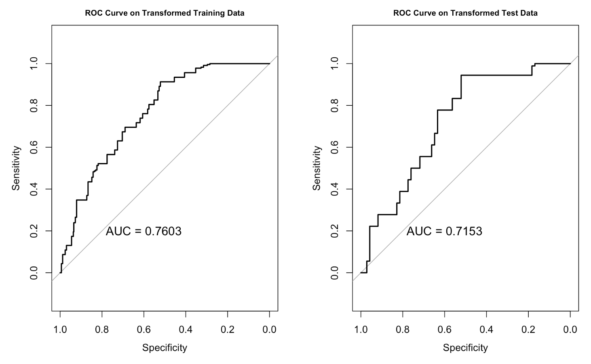
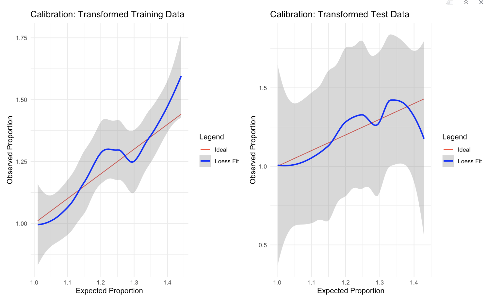

# Investigating Moderators of Success of Behavioral Activation for Smoking Cessation

### Abstract

Individuals with Major Depressive Disorder (MDD) often struggle with smoking, facing more uncomfortable withdrawal symptoms and a higher probability of relapse that those without MDD. However, they are often are excluded from trials examining possible treatments for smokers. Between 2015 and 2020, researchers at Feinberg School of Medicine conducted a randomized, 2x2 factorial design trial comparing Behavioral Activation Therapy to a standard treatment, and Varenicline to a placebo for smoking cessation in participants with lifetime MDD.

They found that Behavioral Activation Therapy (BA) did not outperform the standard treatment with or without the inclusion of Varenicline. We used the data collected during this study to investigate possible moderators of BA on smoking cessation, as well as the main effects of other covariates. To determine which covariates and interactions were important, we used Lasso for variable selection. We split the data into a training and test set (70/30), and selected lambda using 5-fold cross validation. The full model included the main effects of BA, Varenicline, and all additional covariates, interactions of all variables with BA, and interactions of Varenicline with Black and with an indicator for if the participant is on antidepressants. We evaluated AUC-ROC and model calibration on our test set to check the fit of our model. The model produced an AUC of 0.760 on our training set and 0.715 on our test set. The variables selected by Lasso, other than the treatments-which we chose not to penalize, were Non-Hispanic_White, FTCD score, current MDD, and log(Nicotine Metabolite Ratio). No interactions were selected. The standard treatment slightly outperformed BA, Varenicline outperformed the placebo, non-Hispanic White participants had higher odds of smoking cessation than those who were not non-hispanic White, higher FTCD scores and currently having MDD decreased odds of smoking cessation, and higher log(Nicotine Metabolite Ratio) increased odds of smoking cessation. The results of this analysis suggest that having MDD, a higher dependence on nicotine, being non-Hispanic White, and Nicotine Metabolite Ratio can be predictors of success at quitting smoking, reaffirms that Varenicline is effective, and suggests that BA may be less effective than the standard treatment for smoking cessation.

### Files
`Project_2.qmd`: The quarto file which contains the text and code used in my analysis. 

`Project_2.pdf`: The final PDF file containing my report.

### Dependencies

I used R version 4.4.1.

The packages used for this analysis are as follows: 

- Report Generation `knitr` 

- Data Manipulation: `tidyverse`

- Plots and Tables: `corrplot`, `gtsummary`, `gridExtra`, `kableExtra`

- Modeling and Imputation: `glmnet`, `mice`, `pROC`
